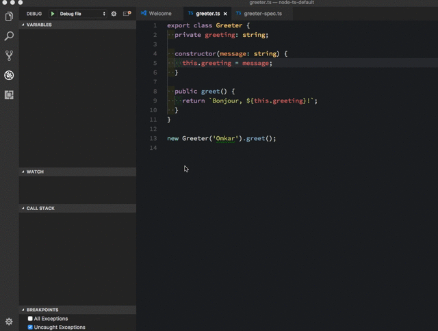

# TypeScript NodeJS Generator
This is a slightly more opinionated version of [generator-node-typescript](https://github.com/ospatil/generator-node-typescript). Thanks to ospatil! 

## Details

- _package.json scripts_  - simplified task runner.
- _yarn_- package manager.
- _mocha_ - test framework.
- _chai_- assertion library.
- _tslint_- configured to use the [airbnb styleguide](https://github.com/progre/tslint-config-airbnb) with the following exceptions:
  - _[import-name](https://www.npmjs.com/package/tslint-microsoft-contrib)_ rule disabled - quickly becomes cumbersome in practice 
- _prettier_- integrated with tslint for easy autoformatting.
- **packages private by default** - useful so that internal teams don't accidentally publish to public npm registry.
- **no global dependencies**. Every dependency such as _TypeScript_ and _tslint_ is installed locally.

## Usage

Install `generator-node-typescript-simple` globally.

```sh
$yarn add global generator-node-typescript-simple
```

Create a new directory and `cd` into it.

```sh
$mkdir my-new-project && cd $_

```

Run the generator.

```sh
$yo node-typescript-simple
```

Build.
```
$yarn build
```

That's it! Keep reading for more details.

## Options

--license - The package.json license
```
$yo node-typescript-simple --license MIT 
```

--author - The package.json author
```
$yo node-typescript-simple --author Bob 
```
## Scripts

```
  "scripts": {
    "clean": "rimraf lib",
    "format": "prettier --write --single-quote \"{src,test}/**/*.ts\"",
    "lint": "tslint --force --project tsconfig.json --format verbose \"src/**/*.ts\"",
    "prepublish": "yarn run build",
    "build": "yarn run format && yarn run clean && yarn run lint && echo Using TypeScript && tsc --version && tsc --pretty",
    "debug": "node --inspect --inspect-brk ./lib/index.js",
    "test": "yarn run build && mocha --compilers ts:ts-node/register --recursive \"test/**/*-tests.ts\"",
    "test:nyan": "yarn run test -- --reporter nyan",
    "test:tap": "yarn run test -- --reporter tap",
    "coverage": "nyc --include=\"src/**/*.ts\" --reporter=text --reporter=html --reporter=lcov mocha --compilers ts:ts-node/register --recursive \"test/**/*-test.ts\"",
    "watch": "yarn run build -- --watch",
    "watch:test": "yarn run test -- --watch"
  }
```

You can generate a new class and test file at any point.

```sh
$yo node-typescript-simple:classlib MyNewClass
```

  ### Integration with VS Code
- `build`, `clean`, `lint`, `coverage`, `format` and `test` tasks are all available through the `Run Task` option.
- You can directly run currently open source file using task `Run current file`. I use [ts-node](https://github.com/TypeStrong/ts-node) to provide this functionality.

  

